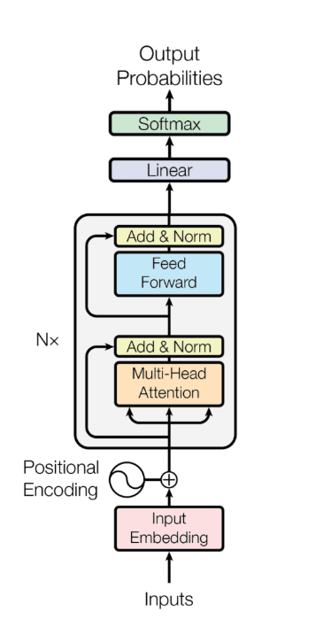
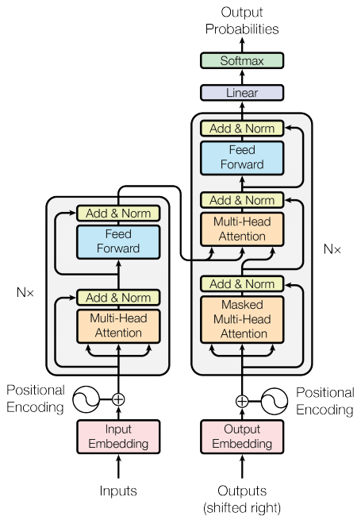
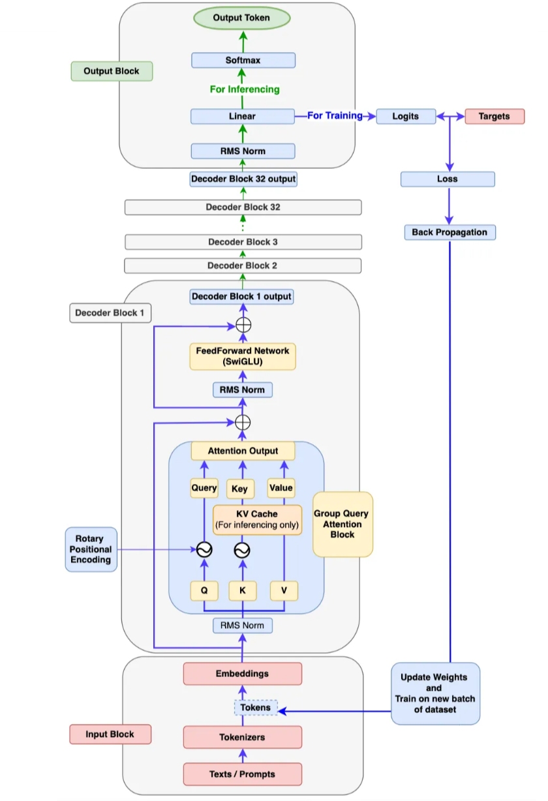

## Minimal Transformer Implementations (Encoder-only, Encoder–Decoder, Decoder-only Llama 3–style)

### Overview
This repository contains three self-contained PyTorch implementations of core Transformer variants:

- **Encoder-only (BERT-like)**: masked self-attention encoder with learned positional embeddings.
- **Encoder–Decoder (seq2seq)**: full Transformer with self-, cross-attention, and rotary positional embeddings (RoPE-inspired).
- **Decoder-only (Llama 3–style)**: causal self-attention decoder using RoPE, RMSNorm, and SwiGLU-style FFN.

The scripts run a forward pass on random token IDs and print tensor shapes and parameter counts (where available). They are educational references, not full training scripts.

### Repository layout
- `encoder_only.py` — BERT-style encoder-only model with learned positional embeddings.
- `encoder_decoder.py` — classic encoder–decoder Transformer with rotary positional encoding and SwiGLU FFN.
- `decoder_only(Llama 3).py` — Llama 3–style decoder-only model with RoPE and RMSNorm.
- `Encoder_Only.png`, `transformer.png`, `Llama_3.png` — architecture diagrams used in the docs.

### Requirements
- Python 3.9+
- PyTorch 2.0+ (CPU or CUDA)

Install PyTorch per your platform/CUDA from the official site, or use a quick pip install for CPU:

```bash
pip install torch --upgrade
```

### Quick start (run the demos)
All scripts can be executed directly. On Windows PowerShell:

```powershell
python .\encoder_only.py
python .\encoder_decoder.py
python ".\decoder_only(Llama 3).py"
```

On macOS/Linux:

```bash
python encoder_only.py
python encoder_decoder.py
python 'decoder_only(Llama 3).py'
```

Each script constructs a model with default hyperparameters, creates random token inputs, runs a forward pass, and prints output shapes. The decoder-only script also prints the total parameter count.

### Architecture diagrams






### Model details

- **Encoder-only (`encoder_only.py`)**
  - Token embedding scaled by \(\sqrt{d_\text{model}}\) and **learned** positional embeddings.
  - Pre-LayerNorm residual connections.
  - Multi-head self-attention without masks (bidirectional encoder).
  - Feed-forward uses GELU; final projection returns log-softmax over the vocabulary.

- **Encoder–Decoder (`encoder_decoder.py`)**
  - Input embeddings (scaled) + rotary positional encoding module applied to hidden states.
  - Standard encoder–decoder stack: self-attention (encoder), self-attention + cross-attention (decoder).
  - Pre-LayerNorm residuals; feed-forward uses SwiGLU-style gating (`w1`, `w3` with SiLU, then `w2`).
  - Helper `build_transformer(...)` constructs the stack end-to-end.

- **Decoder-only Llama 3–style (`decoder_only(Llama 3).py`)**
  - Input embeddings initialized with Normal(0, 0.02); no \(\sqrt{d_\text{model}}\) scaling.
  - Rotary position embeddings (RoPE) applied inside attention to queries/keys.
  - RMSNorm and residual connections (pre-norm inside residual wrapper).
  - Causal masking utility included; final projection returns log-softmax over the vocabulary.

### Customizing hyperparameters
Each script exposes defaults in its `main()` function. Edit the values to fit your hardware:

- `encoder_only.py` (BERT-base defaults): `d_model=768`, `num_layers=12`, `num_heads=12`, `max_len=512`, `d_ff=3072`.
- `encoder_decoder.py` (Transformer): `d_model=512`, `N=6`, `h=8`, `d_ff=2048`, `src_seq_length`, `tgt_seq_length`.
- `decoder_only(Llama 3).py` (large by default): `d_model=4096`, `N=32`, `h=32`, `d_ff=11008`, `seq_length`.

If you encounter out-of-memory (OOM) errors, reduce `d_model`, `N` (layers), `h` (heads), and sequence lengths.

### Notes and limitations
- These scripts demonstrate model construction and a forward pass only; there is no training loop, tokenizer, or dataset code.
- Vocabulary sizes and sequence lengths are placeholders; adapt them for your use case.
- The rotary/learned position embeddings are simplified for clarity and may differ from production implementations.

### References
- Vaswani et al., “Attention Is All You Need.”
- Devlin et al., “BERT: Pre-training of Deep Bidirectional Transformers.”
- RoPE: Su et al., “RoFormer: Enhanced Transformer with Rotary Position Embedding.”
- LLaMA 3 system details as described by Meta AI (high-level design inspiration).


